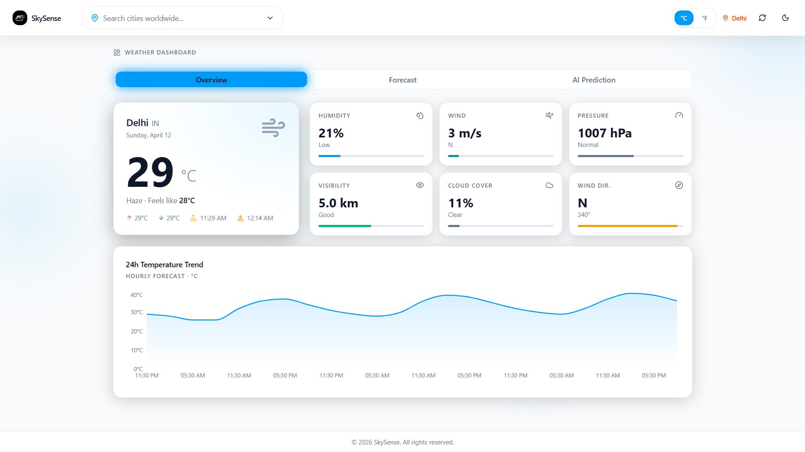
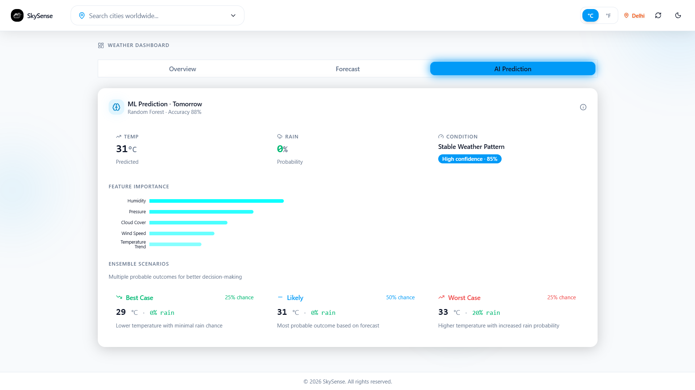
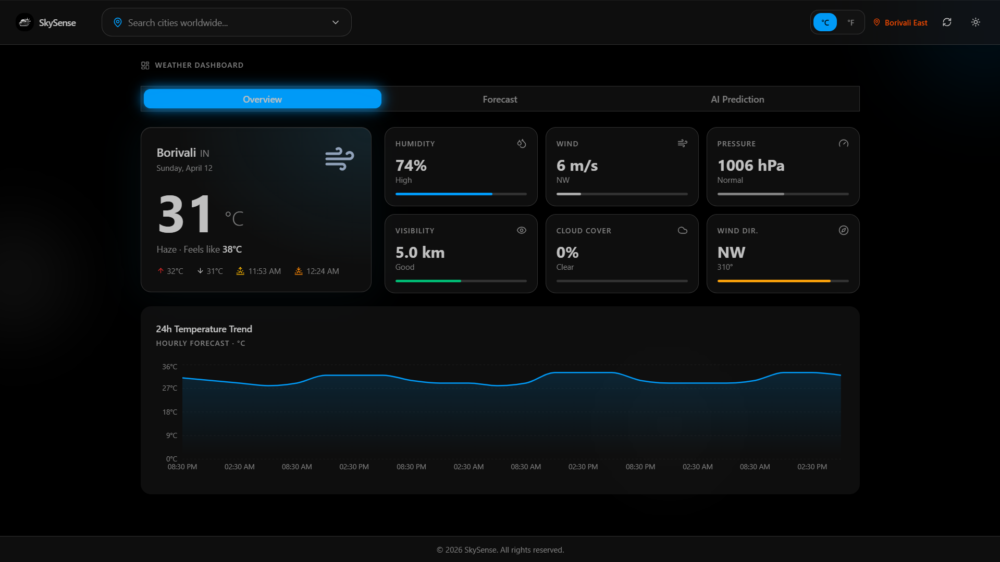
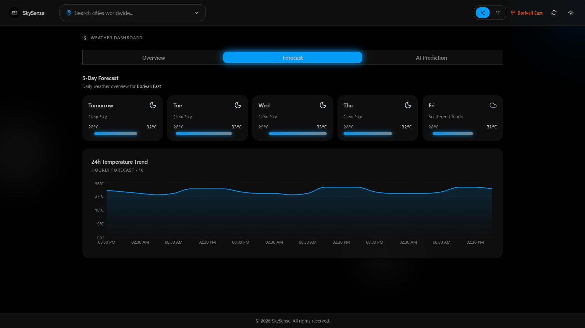
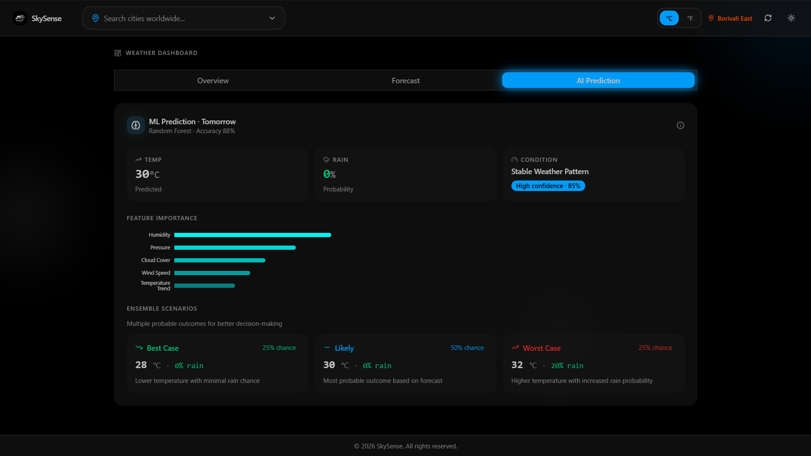

# 🌤️ SkySense: Weather Prediction

<div align="center">

  
  
  
  
  

  <p><strong>Modern weather dashboard with real-time data, ML predictions, and glassmorphic UI.</strong></p>
</div>

---

## 📖 Overview

SkySense is a **predictive weather intelligence tool**. It combines **real-time OpenWeatherMap data** with a custom **RandomForest ML model** to deliver "Best/Likely/Worst" case scenarios. Designed with a **glassmorphic Bento-style dashboard**, it offers a premium experience for both casual users and industries like Agriculture and Construction.

---

## 🚀 Features

- 🌍 **Current Weather & 5-Day Forecast** (OpenWeatherMap)
- 🤖 **ML Predictions** (Rain probability, temperature forecasts)
- 📊 **Interactive Charts** (Hourly trends with Recharts)
- 🎨 **Glassmorphic UI** (Dark/Light theme toggle)
- ⚡ **Fast Development** (React 19 + Vite)
---

# 📸 Interface Previews

<details open>
<summary><b>View Light Mode</b></summary>
<br />

<p align="center">
  
  <br />
  <em>Main Dashboard: Real-time weather metrics with glassmorphic cards.</em>
</p>

<p align="center">
  
  <br />
  <em>AI Predictions: Ensemble scenarios using RandomForest ML.</em>
</p>

</details>

<details>
<summary><b>View Dark Mode</b></summary>
<br />

<p align="center">
  
  <br />
  <em>Dark Mode: High-contrast liquid glass UI for night viewing.</em>
</p>

<p align="center">
  
  <br />
  <em>5-Day Forecast: Clean, minimal layout for upcoming weather trends.</em>
</p>

<p align="center">
  
  <br />
  <em>Advanced ML analytics and feature importance visualization.</em>
</p>

</details>

---

## 🛠 Quick Start

### Backend (Optional for ML)
```bash
cd backend
pip install -r requirements.txt
# Add OPENWEATHER_API_KEY to backend/.env
uvicorn main:app --reload --port 8000
```

### Frontend (Local)
```bash
cd frontend
npm install
npm run dev
```

### Vercel Deployment
```bash
npm install -g vercel
vercel --prod
```
**Required Environment Variable:**
- `VITE_OPENWEATHER_KEY` (get free at https://openweathermap.org/api)

**vercel.json configured for:**
- Frontend-only deployment to `/frontend/dist`
- Framework: null (raw Vite)
- Backend excluded (deploy separately if needed)

---

## 📂 Project Structure

```bash
SkySense/
├── 🐍 backend/                # FastAPI Application
│   ├── ml_model.py           # RandomForest Logic & Scenarios
│   ├── weather_service.py    # OpenWeather API Integration
│   └── main.py               # REST Endpoints
├── ⚛️ frontend/               # React Application
│   ├── src/components/       # Glassmorphic UI Components
│   ├── src/store/            # Zustand State Stores
│   └── src/lib/              # API Client & Mock Data
└── README.md
```

---

## 🔧 Tech Stack

### Frontend
- React 18 + Vite (Vercel compatible)
- TypeScript
- Tailwind CSS + shadcn/ui
- Zustand (Global State)
- TanStack Query (Server State)

### Backend
- FastAPI (Python)
- Scikit-Learn (RandomForest Regressor)
- Pandas & NumPy
- OpenWeatherMap API

---

## 🎯 Usage

1. Search for a city in the top bar.  
2. Switch tabs: **Overview**, **Forecast**, **AI Prediction**.  
3. Enjoy smooth glassmorphism with real-time insights.  

---

## 🛣 Roadmap

- [ ] **Hyper-local Alerts:** Push notifications for sudden weather shifts.  
- [ ] **Satellite Overlays:** Mapbox integration for precipitation visualization.  
- [ ] **Historical Trends:** Compare current weather with 10-year averages.  

---

<div align="center">
  <p>Built with ❤️ by <strong>Abhijith Shetty</strong></p>
  <a href="https://github.com/abhijithshetty12">
    
  </a>
  <a href="https://www.linkedin.com/in/abhijithshetty12">
    
  </a>
</div>
